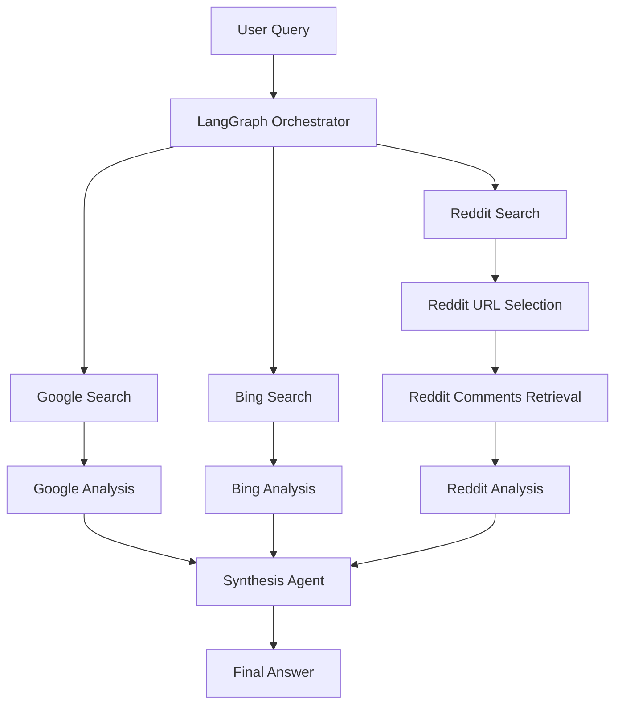

# 🚀 Advanced Langflow Web Agent

A **multi-source AI research agent** that performs **parallel web intelligence gathering** across **Google, Bing, and Reddit**, analyzes each source independently using LLMs, and synthesizes the results into a **single, high-quality answer**.

This project demonstrates **real-world agent orchestration**, **prompt engineering**, **web scraping pipelines**, and **LLM-powered reasoning** using **LangGraph**, **OpenRouter**, and **Bright Data APIs**.

---
 
## ✨ Key Highlights

* 🔄 **Parallel agent workflow** using LangGraph (Google, Bing, Reddit)
* 🧠 **Source-specific LLM analysis** for higher accuracy
* 📊 **Structured Reddit URL filtering** using Pydantic
* 🌐 **Production-grade web scraping** via Bright Data
* 🧵 **Community insight mining** from Reddit posts & comments
* 🧩 **Clean prompt engineering architecture**
* 💬 **CLI-based interactive research assistant**
---

## 🏗️ System Architecture

### High-Level Architecture (ASCII)

```
┌──────────────────┐
│   User (CLI)     │
└────────┬─────────┘
         │ Question
         ▼
┌────────────────────────┐
│ LangGraph Orchestrator │
│ (State + Parallelism)  │
└────────┬───────┬───────┘
         │       │
 ┌───────▼───┐ ┌─▼────────┐ ┌─────────────▼─────┐
 │ Google     │ │ Bing     │ │ Reddit             │
 │ Search     │ │ Search   │ │ Search              │
 └───────┬───┘ └─┬────────┘ └────────┬───────────┘
         │       │                     │
 ┌───────▼───┐ ┌─▼────────┐   ┌────────▼────────┐
 │ Google     │ │ Bing     │   │ URL Selection    │
 │ Analysis   │ │ Analysis │   │ (Structured LLM) │
 └───────┬───┘ └─┬────────┘   └────────┬────────┘
         │       │                     │
         │       │              ┌──────▼────────┐
         │       │              │ Post & Comment │
         │       │              │ Retrieval      │
         │       │              └──────┬────────┘
         │       │                     │
         │       │              ┌──────▼────────┐
         │       │              │ Reddit Analysis│
         │       │              └──────┬────────┘
         │       │                     │
         └───────┴───────────────┬─────┘
                                 ▼
                      ┌────────────────────┐
                      │ Synthesis Agent    │
                      │ (LLM Reasoning)    │
                      └─────────┬──────────┘
                                ▼
                     ┌─────────────────────┐
                     │ Final Answer Output │
                     └─────────────────────┘
```

### Mermaid Diagram (GitHub Compatible)



```
User Query
   │
   ▼
LangGraph Orchestrator
   ├── Google Search Agent ──► Google Analysis (LLM)
   ├── Bing Search Agent   ──► Bing Analysis (LLM)
   └── Reddit Search Agent
          ├── URL Selection (Structured LLM)
          ├── Post & Comment Retrieval
          └── Reddit Analysis (LLM)
   │
   ▼
Final Synthesis Agent (LLM)
   │
   ▼
Comprehensive Answer
```

---

## 🧠 How It Works (Step-by-Step)

1. **User enters a question** via CLI
2. LangGraph launches **Google, Bing, and Reddit searches in parallel**
3. Reddit results are filtered using a **structured LLM output** to select only high-value posts
4. Selected Reddit posts and comments are fetched via Bright Data snapshots
5. Each source is **analyzed independently** using specialized prompts
6. A final **synthesis agent combines all insights** into one answer

This design avoids hallucination, improves coverage, and ensures **multi-perspective reasoning**.

---

## 📂 Project Structure

```
Advanced-Langflow-Web-Agent/
│
├── main.py                  # LangGraph orchestration & CLI chatbot
├── prompts.py               # Centralized prompt templates
├── snapshot_operations.py   # Snapshot polling & download logic
├── web_operations.py        # Google, Bing & Reddit data ingestion
├── .env                     # API keys (not committed)
└── README.md
```

---

## 🔧 Tech Stack

* **Python 3.10+**
* **LangGraph** – multi-agent orchestration
* **OpenRouter** – LLM provider (DeepSeek-R1)
* **Bright Data** – SERP & Reddit datasets
* **Pydantic** – structured LLM outputs
* **dotenv** – secure environment variables
* **Requests** – HTTP networking

---

## 🔑 Environment Variables

Create a `.env` file in the project root:

```
BRIGHT_DATA_API_KEY=your_brightdata_api_key
OPENROUTER_API_KEY=your_openrouter_api_key
```

⚠️ Never commit your `.env` file to GitHub.

---

## ▶️ Running the Project

```bash
pip install -r requirements.txt
python main.py
```

Then ask questions like:

* "Is LangChain better than LlamaIndex?"
* "What do developers think about Rust in production?"
* "Latest opinions on OpenAI vs open-source LLMs"

---

## 🧩 Prompt Engineering Strategy

Each source has **dedicated prompts**:

* 🔍 Google → factual & authoritative data
* 📰 Bing → complementary & enterprise perspectives
* 👥 Reddit → real user experiences & debates
* 🧠 Synthesizer → conflict resolution & structured answer

This separation significantly improves answer quality and transparency.

---

## 💡 Why This Project Stands Out (ATS Optimized)

**Keywords:** Agentic AI, LangGraph, LLM Orchestration, Multi-Agent Systems, Prompt Engineering, Web Scraping, Bright Data, OpenRouter, Research Automation, NLP, Python, API Integration, Data Pipelines

* Designed a **multi-agent AI research system** using LangGraph
* Implemented **parallel execution and state-based orchestration**
* Integrated **real-time web data ingestion** (Google, Bing, Reddit)
* Built **structured LLM outputs** with Pydantic for decision-making
* Applied **prompt engineering best practices** per data source
* Engineered a **fault-tolerant snapshot polling pipeline**
* Synthesized heterogeneous data into **high-quality analytical outputs**

---

## 📘 Case Study: Building a Multi-Source Research Agent

### 🎯 Problem Statement

Traditional chatbots rely on a **single data source** or static APIs, often leading to:

* Hallucinated answers
* Lack of real user perspectives
* Poor coverage of conflicting viewpoints

### 🧠 Solution Approach

This project introduces a **LangGraph-powered agentic system** that:

* Runs **parallel research agents**
* Separates **data collection, analysis, and synthesis**
* Uses **real web and community data**
* Produces answers grounded in **multiple independent sources**

### 🛠️ Key Engineering Decisions

* **LangGraph over chains** → enabled branching, merging, and state tracking
* **Source-specific prompts** → reduced noise and hallucination
* **Structured Reddit filtering** → avoided low-signal content
* **Snapshot-based scraping** → reliable handling of long-running jobs

### 📊 Outcome & Impact

* Higher answer accuracy
* Transparent reasoning pipeline
* Scalable foundation for enterprise research agents
* Production-ready architecture

---

## 🚀 Future Enhancements

* Web UI (Streamlit / Next.js)
* Caching & rate-limit handling
* Citation formatting & source linking
* Additional data sources (X, Hacker News, ArXiv)
* Async execution for faster responses

---

## 👤 Author

**Yash Brahmankar**
AI & Python Developer | Agentic Systems Enthusiast

---

⭐ If you like this project, consider starring the repository!
