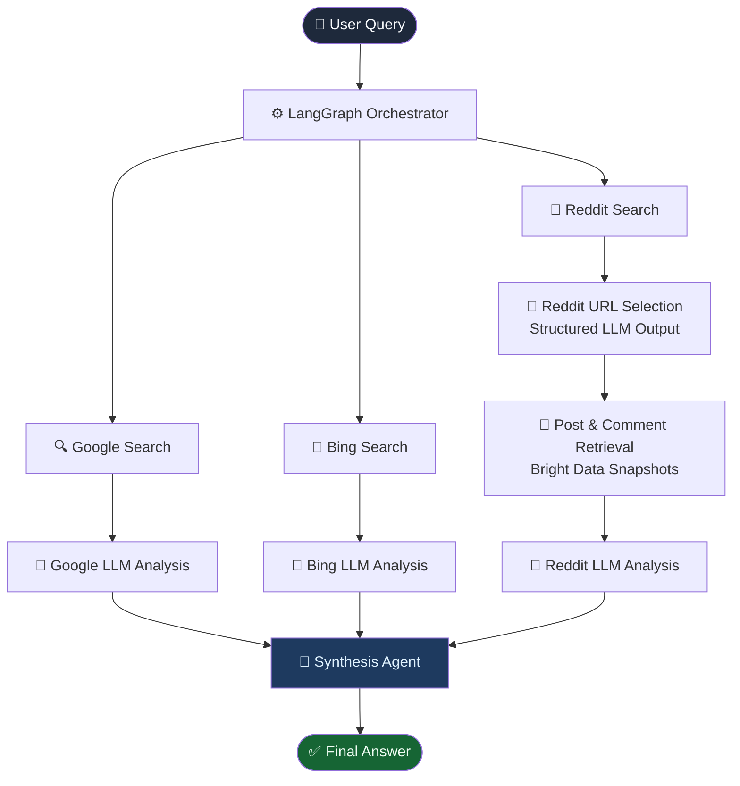

<div align="center">


<br/>

[](https://python.org)
[](https://langchain-ai.github.io/langgraph/)
[](https://openrouter.ai)
[](https://brightdata.com)
[](https://docs.pydantic.dev)
[](LICENSE)
[](.)

<br/>

```
█░█░█ █▀▀ █▄▄   ▄▀█ █▀▀ █▀▀ █▄░█ ▀█▀
▀▄▀▄▀ ██▄ █▄█   █▀█ █▄█ ██▄ █░▀█ ░█░
```

> *Three agents. Three sources. One grounded answer.*
> Production-grade agentic AI with parallel intelligence gathering, source-aware reasoning, and structured synthesis.

<br/>

</div>

---

## 📋 Table of Contents

- [Overview](#-overview)
- [Key Capabilities](#-key-capabilities)
- [System Architecture](#-system-architecture)
- [How It Works](#-how-it-works)
- [Prompt Engineering Strategy](#-prompt-engineering-strategy)
- [Tech Stack](#-tech-stack)
- [Environment Setup](#-environment-setup)
- [Quick Start](#-quick-start)
- [Project Structure](#-project-structure)
- [Design Decisions](#-design-decisions--trade-offs)
- [Case Study](#-case-study-from-problem-to-production)
- [Roadmap](#-roadmap)
- [Contributing](#-contributing)
- [Author](#-author)

---

## 📖 Overview

Most AI assistants answer from a single source — often stale, often biased, and frequently hallucinated.

**This project takes a different approach.**

It deploys three specialized research agents in parallel — each scraping, filtering, and reasoning over a distinct data source (Google, Bing, Reddit) — then funnels their independent analyses into a final synthesis agent that reconciles conflicts and delivers a well-grounded, multi-perspective answer.

> Built to demonstrate real-world agentic AI design: parallel execution, structured LLM outputs, source-specific prompt engineering, and fault-tolerant scraping pipelines.

---

## ⚡ Key Capabilities

| Capability | Details |
|---|---|
| 🔄 **Parallel Agent Execution** | Google, Bing, and Reddit agents run simultaneously via LangGraph |
| 🧠 **Source-Aware LLM Reasoning** | Each source uses dedicated prompts tuned for its content type |
| 📊 **Structured Reddit Filtering** | Pydantic-validated LLM output selects only high-signal posts |
| 🌐 **Production Web Scraping** | Bright Data SERP & snapshot APIs for reliable data ingestion |
| 🧵 **Community Insight Mining** | Extracts real user opinions from Reddit threads & comments |
| 🧩 **Modular Prompt Architecture** | Centralized, versioned prompt templates in `prompts.py` |
| 💬 **Interactive CLI Interface** | Conversational research assistant, runnable locally |

---

## 🏗️ System Architecture

### Agent Flow

```
┌─────────────────────────────────────────────────────────┐
│                        User (CLI)                        │
└─────────────────────────┬───────────────────────────────┘
                          │  Query
                          ▼
┌─────────────────────────────────────────────────────────┐
│              LangGraph Orchestrator                      │
│         (State Management · Parallel Dispatch)          │
└──────────┬──────────────┬──────────────┬───────────────┘
           │              │              │
    ┌──────▼──────┐ ┌─────▼─────┐ ┌─────▼──────────────┐
    │ Google      │ │ Bing      │ │ Reddit              │
    │ Search      │ │ Search    │ │ Search              │
    └──────┬──────┘ └─────┬─────┘ └─────┬──────────────┘
           │              │              │
    ┌──────▼──────┐ ┌─────▼─────┐ ┌─────▼──────────────┐
    │ Google LLM  │ │ Bing LLM  │ │ URL Selection       │
    │ Analysis    │ │ Analysis  │ │ (Structured LLM)    │
    └──────┬──────┘ └─────┬─────┘ └─────┬──────────────┘
           │              │              │
           │              │       ┌──────▼──────────────┐
           │              │       │ Post + Comment       │
           │              │       │ Retrieval            │
           │              │       └──────┬──────────────┘
           │              │              │
           │              │       ┌──────▼──────────────┐
           │              │       │ Reddit LLM Analysis  │
           │              │       └──────┬──────────────┘
           │              │              │
           └──────────────┴──────────────┘
                          │
                          ▼
          ┌───────────────────────────────┐
          │      Synthesis Agent          │
          │  (Conflict Resolution · LLM)  │
          └───────────────┬───────────────┘
                          │
                          ▼
              ┌─────────────────────┐
              │    Final Answer     │
              └─────────────────────┘
```

### Mermaid Diagram


```mermaid
flowchart TD
    U([👤 User Query]) --> LG[⚙️ LangGraph Orchestrator]

    LG --> G[🔍 Google Search]
    LG --> B[📰 Bing Search]
    LG --> R[👥 Reddit Search]

    G --> GA[🧠 Google LLM Analysis]
    B --> BA[🧠 Bing LLM Analysis]

    R --> RU[📌 Reddit URL Selection\nStructured LLM Output]
    RU --> RC[💬 Post & Comment Retrieval\nBright Data Snapshots]
    RC --> RA[🧠 Reddit LLM Analysis]

    GA --> S[🔬 Synthesis Agent]
    BA --> S
    RA --> S

    S --> F([✅ Final Answer])

    style U fill:#1e293b,color:#f8fafc
    style F fill:#166534,color:#f0fdf4
    style S fill:#1e3a5f,color:#e0f2fe
```

---

## 🧠 How It Works

### Step-by-Step Pipeline

```
1. User submits a question via CLI
       │
2. LangGraph dispatches three parallel agents:
   ├── Google Agent  → SERP results → LLM factual analysis
   ├── Bing Agent    → SERP results → LLM complementary analysis
   └── Reddit Agent
            ├── Search Reddit via Bright Data
            ├── Structured LLM selects high-signal post URLs
            ├── Snapshot API fetches posts + top comments
            └── LLM extracts community sentiment & insights
       │
3. Synthesis Agent receives all three analyses
   → Resolves conflicts, fills gaps, ranks perspectives
       │
4. Final answer delivered to user
```

### Why Parallel, Not Sequential?

Sequential pipelines bottleneck on the slowest step. Parallel dispatch cuts total latency to **max(agent time)** instead of **sum(agent time)** — critical when each agent involves external API calls and LLM inference.

### Why Source-Specific Prompts?

A single generic prompt applied to a Reddit comment thread produces very different (and worse) results than a prompt tuned to extract **opinion, sentiment, and community consensus** from informal text. Source-aware prompting is one of the biggest levers for output quality in multi-source RAG systems.

---

## 🧩 Prompt Engineering Strategy

| Agent | Prompt Focus | Why |
|---|---|---|
| 🔍 **Google** | Factual accuracy, authoritative sourcing | Google SERP skews toward structured, high-credibility content |
| 📰 **Bing** | Enterprise & technical perspectives | Bing surfaces different indexing priorities than Google |
| 👥 **Reddit** | Opinions, debates, lived experience | Reddit content is informal — requires different parsing logic |
| 🔬 **Synthesizer** | Conflict resolution, structured answer | Must weigh and reconcile three different tones and formats |

All prompts are centralized in `prompts.py` for easy versioning, testing, and iteration.

---

## 🔧 Tech Stack

| Layer | Technology | Role |
|---|---|---|
| **Orchestration** | LangGraph | Multi-agent state machine, parallel execution |
| **LLM Provider** | OpenRouter (DeepSeek-R1) | Reasoning, analysis, structured output |
| **Web Intelligence** | Bright Data | SERP APIs, Reddit snapshot scraping |
| **Data Validation** | Pydantic | Structured LLM output parsing |
| **Networking** | Requests | HTTP client for API calls |
| **Config** | python-dotenv | Secure environment variable loading |
| **Language** | Python 3.10+ | Core runtime |

---

## 🔑 Environment Setup

Copy `.env.example` to `.env` and fill in your keys:

```bash
cp .env.example .env
```

```env
BRIGHT_DATA_API_KEY=your_brightdata_api_key
OPENROUTER_API_KEY=your_openrouter_api_key
```

> ⚠️ Never commit `.env` to version control. It is already listed in `.gitignore`.

---

## 🚀 Quick Start

```bash
# 1. Clone the repository
git clone https://github.com/loisekk/Advanced-Langflow-Web-Agent.git
cd Advanced-Langflow-Web-Agent

# 2. Create and activate a virtual environment
python -m venv venv
source venv/bin/activate        # Windows: venv\Scripts\activate

# 3. Install dependencies
pip install -r requirements.txt

# 4. Configure environment variables
cp .env.example .env
# Edit .env with your API keys

# 5. Run the agent
python main.py
```

### Example Queries

```
> Is LangChain better than LlamaIndex for production RAG?
> What do engineers think about Rust vs Go for backend services?
> Latest community opinions on GPT-4o vs open-source LLMs
> How are developers using LangGraph in real projects?
```

---

## 📂 Project Structure

```
Advanced-Langflow-Web-Agent/
│
├── main.py                    # LangGraph graph definition, state, CLI loop
├── prompts.py                 # All LLM prompt templates (centralized)
├── snapshot_operations.py     # Bright Data snapshot polling & download
├── web_operations.py          # Google, Bing & Reddit search + ingestion
├── requirements.txt           # Python dependencies
├── .env.example               # Environment variable template
└── README.md                  # You are here
```

---

## 🛡️ Design Decisions & Trade-offs

| Decision | Chosen Approach | Alternative Considered | Rationale |
|---|---|---|---|
| **Orchestration** | LangGraph | LangChain chains | LangGraph supports branching, state, and parallel nodes natively |
| **LLM Output Parsing** | Pydantic structured outputs | Regex / manual parsing | Type-safe, validated, and far more maintainable |
| **Reddit Scraping** | Bright Data snapshots | Reddit API (PRAW) | Avoids rate limits; handles long-running scrape jobs reliably |
| **Prompt Strategy** | Per-source templates | Single universal prompt | Source-specific prompts dramatically improve signal-to-noise ratio |
| **Execution Model** | Parallel agents | Sequential pipeline | Reduces total latency from sum to max of agent runtimes |

---

## 📊 Case Study: From Problem to Production

### Problem
Traditional AI assistants answer from a single data source — leading to hallucinations, missing community perspectives, and poor coverage of contested topics.

### Approach
A LangGraph agentic system that separates **data collection**, **source-specific analysis**, and **cross-source synthesis** into distinct, independently optimized stages.

### Engineering Outcomes
- Eliminated single-source bias via triangulated web + community data
- Achieved fault tolerance through snapshot-based scraping (retry-safe)
- Established a clean separation of concerns across four agent roles
- Built a reusable, extensible foundation for enterprise research agents

---

## 🗺️ Roadmap

| Enhancement | Priority |
|---|---|
| ⚡ Async execution — replace `requests` with `httpx` | High |
| 🖥️ Web UI — Streamlit or Next.js front-end | High |
| 🗄️ Caching layer — Redis-backed query result caching | Medium |
| 📎 Source citations — formatted references in final output | Medium |
| 🔎 Additional sources — Hacker News, ArXiv, X (Twitter) | Medium |
| 🧪 Evaluation suite — automated benchmarking of answer quality | Low |
| 🐳 Docker support — containerized deployment | Low |

---

## 🤝 Contributing

Contributions are welcome and appreciated.

```bash
# Fork → Branch → Commit → Pull Request
git checkout -b feature/your-feature-name
```

Please open an issue first for major changes to align on direction.

---

## 👨‍💻 Author

<div align="center">

**Yash Brahmankar**

*AI & Python Developer · Agentic Systems · LLM Engineering*

<br/>

[](https://github.com/loisekk)
[](mailto:yashbrahmankar95@gmail.com)
[](https://linkedin.com/in/)

<br/>

⭐ **If this project was useful, a star goes a long way — thank you.**

</div>

---

<div align="center">


*Built with intelligence and Python by Yash Brahmankar*

</div>
